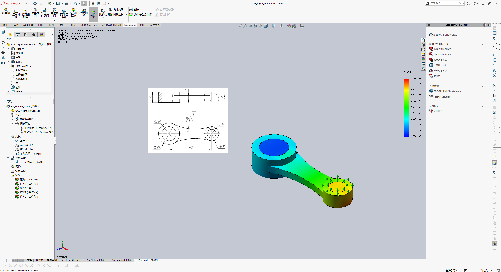

# CAD-CAE Agent — SolidWorks 建模与仿真

**中文文档 V2（2026-09-29）**

本项目基于 [andrewbartels1/SolidworksMCP-python](https://github.com/andrewbartels1/SolidworksMCP-python) 的 MIT 开源代码，扩展了在 **SOLIDWORKS 2020 SP5** 上运行的参数化建模和 Simulation 静力分析流程。保留上游版权及许可证；[上游英文说明](README.en.md)单独存档。



## 从 API 绘图到 CAD-CAE Agent

最初的本机目标是通过 C# COM API 直接控制 SOLIDWORKS，生成 `Sketch1 → Boss-Extrude1`，并检查一个 100 × 60 × 10 mm 零件。现在的流程由 AI 客户端规划，MCP 暴露工具，Windows 上的 SOLIDWORKS COM 与 Simulation 执行建模、求解和结果回读。MCP 是工具接口；单独启动 MCP 不会形成独立自主的 Agent。

详细的时间线、证据和差异见 [API 绘图到 CAD-CAE Agent：版本 V2](docs/API绘图到CAD-CAE-Agent_演进_V2.md)。

## 项目概览

本项目以可检查的迭代流程组织 SOLIDWORKS 自动化：

1. 描述几何或工程意图，明确尺寸、材料、载荷和约束。
2. 由 AI 客户端制定建模或仿真步骤。
3. 调用 MCP 工具，由 COM API 在真实 SOLIDWORKS 中执行。
4. 回读特征树、实体、研究、求解结果和输出文件。
5. 对失败或异常结果定位原因，再修正计划。

上游提供 Python MCP 服务、COM/VBA 适配与安全封装，以及草图、建模、工程图、分析、导出、自动化、模板和宏工具；可选的 Agent 编排与提示词测试代码位于 `src/solidworks_mcp/agents/`。本仓库增加了 SW2020 稳定入口、建模守卫和 Simulation 静力扩展。上游的功能目录与本仓库的**实测范围**应分别阅读。

## 已实现与验证

| 能力 | 本机证据 |
| --- | --- |
| 直接 COM 建模 | 实测创建、重建并保存 `Sketch1 → Boss-Extrude1`；几何为 100 × 60 × 10 mm，体积 60,000 mm³。 |
| MCP 建模 | SW2020 真实模式下完成工具调用、实体与特征回读；工具发现保持 COM 延迟连接。 |
| 静力分析 | 本机 SW2020 SP5 / Simulation 完成多载荷、多网格、URES(mm) 云图及原生结果归档。 |
| 销轴接触 | 三实体、两组无穿透接触；位移相邻网格变化低于 1%，峰值应力未达到同一收敛标准。 |
| 重新连接 | 两次新 stdio 连接均发现 149 个工具，其中 8 个为仿真工具；原生研究和结果可回读。 |

本机验证细节：[安装与演示](README_CAE.md) · [仿真计划接口](SIMULATION_PHASE3.md) · [数值和限制](docs/cae/verification.md) · [SW2020 兼容性](SW2020_COMPAT.md)。

## 当前边界

- Mock 适配器的输出是模拟值，不能作为工程结论。
- 实时 3D 视口流、逐检查点的干涉验证、流体分析及本静力扩展范围外的仿真类型尚未验证；简单 SimulationXpress 拓扑优化也不属于已验证能力。
- 示例销轴工况的 1000 N 载荷、零间隙、无摩擦和外部导向是建模假设。位移收敛不能证明峰值应力、局部接触压力、疲劳或真实设备安全性。
- 不能将示例面 ID、约束和载荷直接套用到其他零件；任意零件自动选面和自动识别实际安装方式尚未验证。

## 环境与快速开始

真实 COM 自动化需要 Windows、Python 3.13+、Git，以及已合法安装的 SOLIDWORKS。**本仓库的新增能力实测于 SW2020 SP5；上游徽章中的其他年份不代表本仓库已逐一验证。** Linux/WSL 可用于文档、测试和 Mock 模式，不能直接执行 Windows COM 自动化。

```powershell
git clone https://github.com/caoguanqiu1-alt/CAD-CAE-Agent.git
cd CAD-CAE-Agent
py -3.13 -m venv .venv
& .\.venv\Scripts\python.exe -m pip install -e .
$env:SW2020_INSTALL_DIR = 'C:\Program Files\SOLIDWORKS Corp\SOLIDWORKS'
powershell -NoProfile -File .\simulation\build.ps1 -InstallDir $env:SW2020_INSTALL_DIR
```

将安装目录改为自己的实际路径。真实执行使用 `src/utils/start_sw2020_stable.py --real --year 2020`；MCP 初始化与工具列表不应启动 SOLIDWORKS，首次实际工具调用才连接 COM。Simulation 还需要本机可用的 SOLIDWORKS Simulation 与对应 Interop DLL。完整 MCP 配置和调用步骤见 [中文安装与演示说明](README_CAE.md)；上游通用客户端配置、开发命令及功能开关见 [英文原文](README.en.md)。

项目持续开发，接口、文档和安装步骤可能调整。SOLIDWORKS、Simulation 及其 Interop DLL 不随仓库分发。

## 文档与许可

- [上游文档站](https://andrewbartels1.github.io/SolidworksMCP-python/) · [本仓库上游英文说明](README.en.md) · [上游西班牙文说明](README.es-ES.md)
- [工具目录](docs/user-guide/tool-catalog) · [架构](docs/user-guide/architecture.md) · [Agent 与提示词测试](docs/agents/agents-and-testing.md)
- MIT License，见 [LICENSE](LICENSE)。
