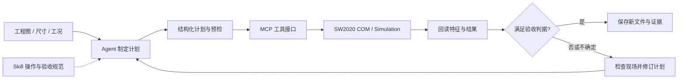
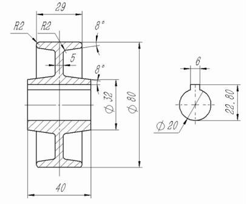
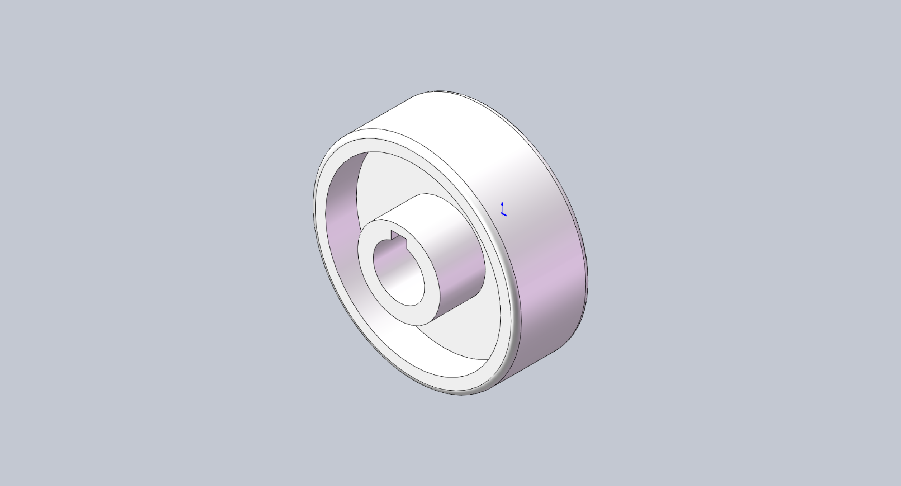
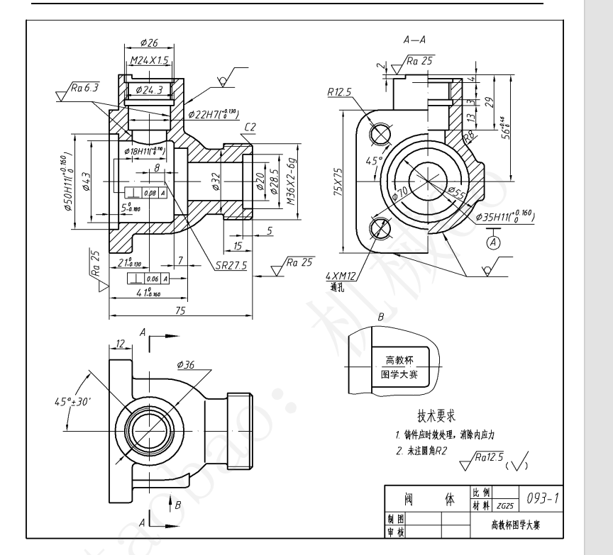
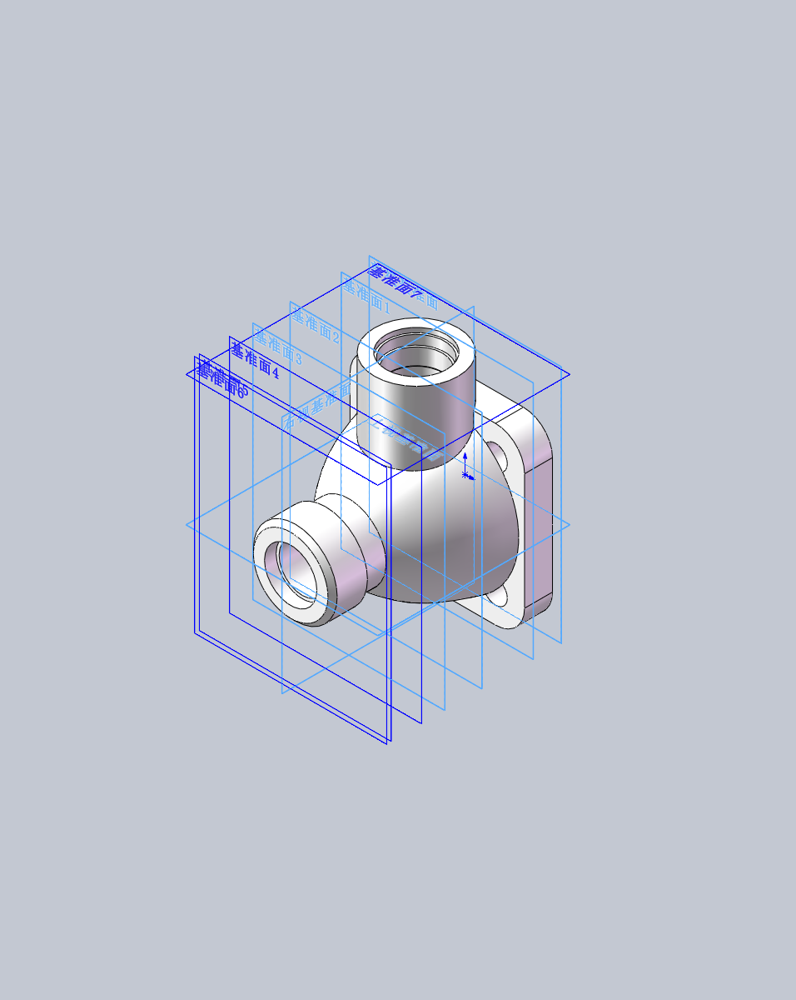
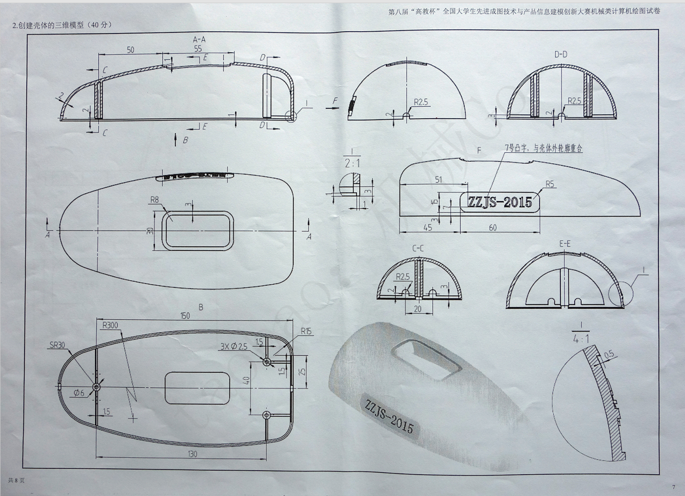
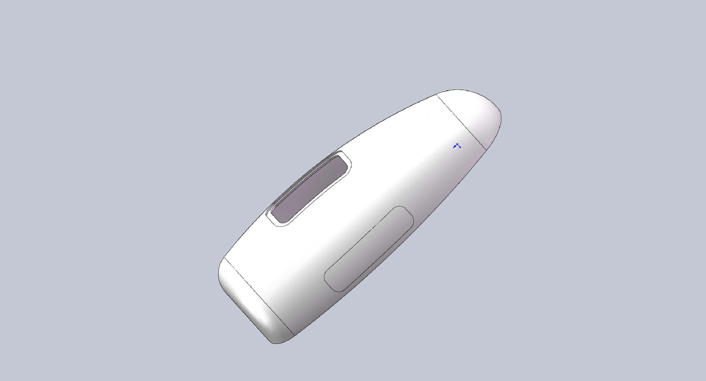
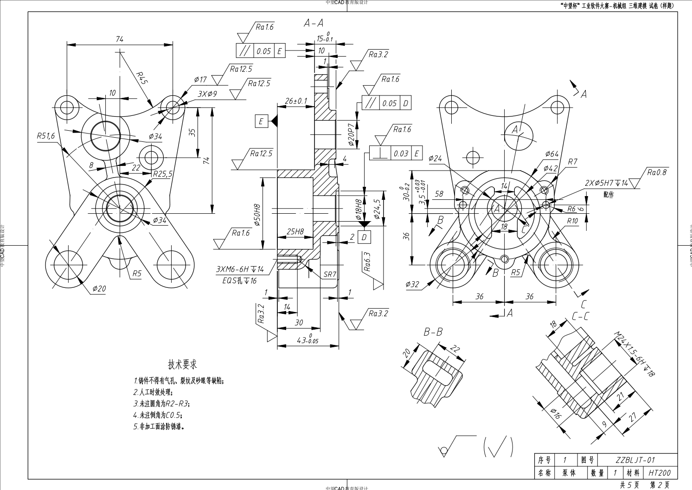
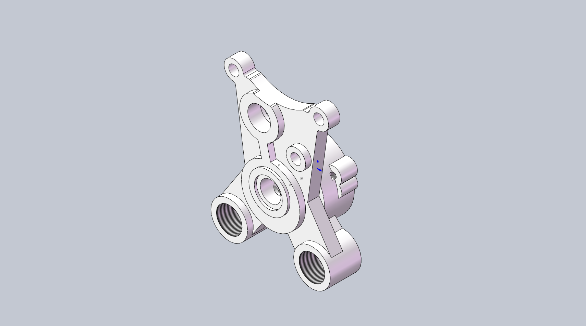
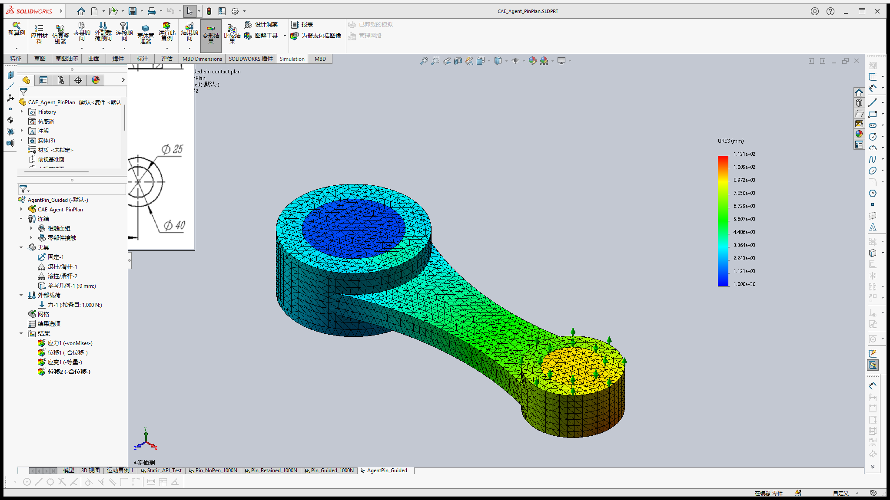

# CAD-CAE Agent — SolidWorks 建模与仿真

**CAD/CAE 案例 + 可复跑对照实验**

让 Agent 将工程图和分析目标转成 **可执行的计划、真实的软件操作和可检查的结果**：由 Skill 组织工作流程，MCP 提供工具接口，SOLIDWORKS 2020 / Simulation 执行建模与静力分析。

本项目基于 [andrewbartels1/SolidworksMCP-python](https://github.com/andrewbartels1/SolidworksMCP-python) 的 MIT 开源代码，扩展了在 **SOLIDWORKS 2020 SP5** 上运行的参数化建模和 Simulation 静力分析流程。保留上游版权及许可证；[上游英文说明](README.en.md)单独存档。

[项目目标](#项目目标与工作方式) · [Skill 与 MCP](#skill-与-mcp-给-agent-带来什么) · [对照实验](#可复跑对照实验) · [CAD 案例](#cad-建模案例从工程图到三维模型) · [CAE 图集](#cae-仿真过程与结果图集) · [快速开始](#环境与快速开始) · [验证范围](#已实现与验证)

## 项目目标与工作方式

机械任务的难点不仅是调用一个拉伸或求解命令，还包括读懂尺寸与剖面关系、选择合理的建模顺序、确认操作对象，并判断结果是否满足要求。本项目把这些环节组织成 **计划 → 预检 → 执行 → 回读 → 验收** 的迭代流程。

例如，用户要求一个 100 × 60 × 10 mm 的矩形零件，接口返回“拉伸成功”只是执行反馈。Agent 还需要检查 1 个实体、60,000 mm³ 的独立预期体积、所需特征和原生输出文件。对静力分析，也需要分别检查工况、反力与网格变化，不能仅以求解器成功或云图颜色作为验收依据。

适用任务包括从工程图重建零件、按明确参数批量生成草图与凸台/切除、组织多载荷和多档网格静力分析，以及对失败步骤进行回查。交付以新版本的原生 CAD 文件、结果归档、截图和验证记录为目标；当前公开仓库提供代码、文档、截图和脱敏数值，原生 CAD/CWR 算例留在本地。



Agent 负责理解任务和选择步骤；MCP 服务负责执行已实现的工具。单独启动 MCP 服务不会形成独立自主的 Agent。预检拒绝、部分完成和未知执行结果也都属于反馈，调用方需据此决定后续操作。

## Skill 与 MCP 给 Agent 带来什么

| 层次 | 解决的问题 | 本项目中的作用 |
| --- | --- | --- |
| **Agent** | 将用户意图转成步骤，并处理反馈 | 读图、拆分特征、选择工具、判断差异；能力取决于具体模型与客户端。 |
| **Skill** | 复用领域经验与操作顺序 | 明确单位和基准，先预检再执行，使用独立预期验收；异常写入后先检查现场。 |
| **MCP** | 将外部能力作为结构化工具提供给 Agent | 工具发现、参数与结果传递；将建模、状态回读和仿真计划接入同一客户端。 |
| **COM / Simulation** | 真正修改模型与求解 | 在实际 SOLIDWORKS 中生成特征、保存文件、划分网格并读取结果。 |

**Skill 的提升在于把操作经验变成可重复的流程。** Agent 处理相似零件时，可以复用单位、输出路径、验收方法与异常处理规范，减少每次临时组织步骤的需要。它也能提醒 Agent 将“图片看起来正确”推进到实体、尺寸、文件和结果检查。Skill 是否触发、是否被遵守，需要通过真实 Agent 轨迹另外评估。[OpenAI 的 Skill 评估方法](https://developers.openai.com/blog/eval-skills)建议对完成结果、执行步骤和效率分别评分。

**MCP 的提升在于让 Agent 获得执行和观察的接口。** 本仓库的具体工具进一步实现了批量计划、严格输入校验、文档身份检查、状态回读与持久请求 ID。它们让多步任务可以被预检、追踪和复核。协议传输本身有开销；效率收益来自批量工具的设计，错误拦截来自服务端的具体实现。[MCP 官方 SDK](https://ts.sdk.modelcontextprotocol.io/v2/)将 MCP 定位为连接 AI 应用与外部系统的开放标准。

二者结合后，Skill 指导 Agent **何时调用、怎样验收**，工具实现约束 **哪些输入可以执行、发生了什么、结果是否符合预期**。这样可以将部分经验要求落实为程序检查，同时保留对工程假设和图纸未标注部分的人工判断。

当前仓库发布 MCP 代码和流程文档；本机使用 `solidworks-2020-modeling` / `solidworks-mcp-development` Skill，独立可安装的 Skill 包尚未随仓库分发。跨项目复用时，可将[建模规范](SW2020_WORKFLOW.md)与[仿真流程](SIMULATION_PHASE3.md)纳入自己的 Skill，并按客户端方式显式加载。

### 从任务到交付的工具链

| 阶段 | 建模路径 | 静力分析路径 |
| --- | --- | --- |
| 明确输入 | 图纸关键尺寸、建模基准、独立预期体积 | 几何、材料、安装方式、力与约束、收敛判据 |
| 检查对象 | `sw2020_preflight` 检查版本、活动文档和草图状态 | `sw_simulation_check` / `sw_simulation_inspect_geometry` 检查干净副本和面引用 |
| 准备计划 | `sw2020_validate_plan` 编译依赖、单位和特征配方 | 准备显式载荷、接触、限位及递减网格计划 |
| 执行 | `sw2020_execute_plan` / `sw2020_build_batch` | `sw_simulation_run_plan`；逐步排错可用 `sw_simulation_general_step` |
| 验收 | 实体、特征、几何指标、保存后重开与比较 | 位移和应力分别检查、反力平衡、原生结果归档与回读 |

`sw2020-plan/1` 当前支持矩形、圆、闭合多边形草图及凸台/切除，1–30 个组；复杂放样、抽壳等案例使用其他工具或 COM 流程完成，不应推断它们已被该计划格式覆盖。相同请求 ID 与参数可回放历史记录而不重复建模；参数改变会被拒绝。历史回放不是实时验证，`partial / started / unknown` 后须先检查实际状态。

## 可复跑对照实验

2026-09-30 实际运行同条件对照：**真实 MCP stdio、现有生产校验函数、40 对计时与人工故障注入**。计时组使用相同的 12 个独立节点，预热 5 对、轮换执行顺序，每轮检查编译后的 groups 完全一致。

| 指标 | 对照策略 | 改进策略 | 本次观察 |
| --- | --- | --- | --- |
| 每任务 MCP 调用数 | 逐项计划：12 次 | 批量计划：1 次 | 减少 **91.7%** |
| 计划校验中位往返耗时 | 逐项：**16.55 ms** | 批量：**1.97 ms** | 减少 **88.1%**；中位数比值 **8.41** |
| 计划校验 P95 | 逐项：20.05 ms | 批量：2.46 ms | 40 对计时，未剔除样本 |
| 12 类非法输入拦截 | 不校验就转发：0/12 | schema 与依赖检查：**12/12** | 两项正常输入均通过 |
| 8 类错误结果检出 | 只看 success：0/8 | 指标与特征类型核验：**8/8** | 两项正常结果均通过 |

**这些数据量化的是批量接口和显式校验的收益。** 输入错误包括单位、版本、重复名称、缺失/循环依赖、非法尺寸等；结果错误包括体积、质心、实体数、拓扑计数和特征类型。补充停止轨迹实验中，未保存文档在创建研究前被拦截，创建返回未知时未自动重试。

直接 Python 批量编译的中位耗时为 **0.25 ms**，说明 MCP 本身增加了通信成本。纯计划校验也不能检查真实基准面或证明预期体积正确；指标相同不能证明几何完全一致。实验未调用 LLM、COM 建模或有限元求解，**不据此宣称 Agent 智能、真实建模速度、任务成功率或 token 成本改善**。Skill 文件的独立效果仍需固定模型与工具的 LLM A/B 实验。

[完整方法与限制](experiments/README.md) · [复跑脚本](experiments/agent_workflow_benchmark.py) · [原始数据 JSON](experiments/results/2026-09-30/results.json) · [40 轮计时 CSV](experiments/results/2026-09-30/timings.csv)

```powershell
# 安装项目依赖后执行；无需启动 SOLIDWORKS
& .\.venv\Scripts\python.exe experiments/agent_workflow_benchmark.py `
  --repetitions 40 --warmups 5 --nodes 12 `
  --output experiments/results/local-rerun
```

## CAD 建模案例：从工程图到三维模型

以下四个案例均来自用户提供的工程图，已有真实 **SOLIDWORKS 2020** 建模及原生文件保存记录。左侧为输入工程图，右侧为实际建模预览；点击图片可查看原图。

按本次建模涉及的特征、空间关系和读图复杂度，由易到难排列： **皮带轮 → 阀体 → 壳体 → 泵体**。这是案例间的相对排序；模型达到的完成范围见各项说明和[建模证据记录](docs/modeling/showcase.md)。

| 案例 | 主要读图与建模难点 | 展示重点 |
| --- | --- | --- |
| 皮带轮 | 轮毂、轮辐和轮缘的尺寸关系，通孔与键槽 | 基础体构建、切除、圆角和几何检查 |
| 093-1 阀体 | 不同方向接口与剖面流道之间的空间关系 | 放样过渡、孔系组合和缺失尺寸的合理补形 |
| ZZJS-2015 壳体 | 外形与内部壁厚、螺钉柱、筋和窗口的协调 | 薄壁结构、多特征组织和重建检查 |
| ZZBLJT-01 泵体 | 偏心泵腔、斜向流道及多剖面细节 | 综合重建、参考工程图及关联尺寸核验 |

### 1. 皮带轮 · 基础

**展示能力：** 轮毂、轮辐、轮缘、通孔、键槽与圆角。

以尺寸关系较直观的轮状零件作为入口，展示如何将二维轮廓拆成基础实体和局部切除，再检查实体数、主要尺寸与体积。外观重建与参考特征树复现分别说明，便于判断达到的范围。

<table>
<tr><th width="50%">用户提供的工程图</th><th width="50%">真实 SOLIDWORKS 建模结果</th></tr>
<tr><td align="center"><a href="docs/modeling/assets/pulley-drawing.png"></a></td><td align="center"><a href="docs/modeling/assets/pulley-model.png"></a></td></tr>
</table>

SW2020 参考重建已保存，1 个实体；主要尺寸和体积已检查。 8° 内侧斜壁尚未建立；采用凸台特征，未复现参考中的三个旋转特征。

### 2. 093-1 阀体 · 进阶

**展示能力：** 法兰、放样过渡、交叉接口、阶梯流道与安装孔。

难度增加在于多个方向的接口及内部流道，需要结合视图和剖面组织建模顺序。对于图纸未给出的铸造外形，保留合理补形的说明，避免将推断尺寸写成原图要求。

<table>
<tr><th width="50%">用户提供的工程图</th><th width="50%">真实 SOLIDWORKS 建模结果</th></tr>
<tr><td align="center"><a href="docs/modeling/assets/valve-drawing.png"></a></td><td align="center"><a href="docs/modeling/assets/valve-model.png"></a></td></tr>
</table>

真实 COM/MCP 建模已保存，1 个实体，重建成功；包围尺寸 75 × 56 × 75 mm。 未标注外形按用户允许合理补形；接口未生成实体螺纹，部分铸造内腔与圆角有简化。

### 3. ZZJS-2015 壳体 · 复杂

**展示能力：** 曲面外形、抽壳、螺钉柱、加强筋、窗口与随形凸字。

壳体案例将外观与内部结构结合起来：薄壁、螺钉柱和加强筋会相互影响，单一拉伸难以表达完整零件。展示重点是多特征建模与重建检查；过程预览和最终保存重开证据分别标注。

<table>
<tr><th width="50%">用户提供的工程图</th><th width="50%">真实 SOLIDWORKS 建模结果</th></tr>
<tr><td align="center"><a href="docs/modeling/assets/housing-drawing.png"></a></td><td align="center"><a href="docs/modeling/assets/housing-model.png"></a></td></tr>
</table>

原生重建模型已保存，1 个实体，重建检查通过；包含 2 mm 壁厚与内部结构。 用户停止任务前已保存；最终保存重开验证未完成，现有预览来自建模过程。

### 4. ZZBLJT-01 泵体 · 综合

**展示能力：** 偏心泵腔、多孔系、斜向流道、装饰螺纹与工程图。

泵体要求同时处理偏心、不同方向的流道和剖面台阶，适合作为综合案例。除了三维重建，还展示参考工程图与关联尺寸核验；快速重建保留的简化项列在结果说明中。

<table>
<tr><th width="50%">用户提供的工程图</th><th width="50%">真实 SOLIDWORKS 建模结果</th></tr>
<tr><td align="center"><a href="docs/modeling/assets/pump-drawing.png"></a></td><td align="center"><a href="docs/modeling/assets/pump-model.png"></a></td></tr>
</table>

快速重建已保存，1 个连续实体，重建成功；另完成四视图参考工程图和 10 项关联尺寸核验。 部分铸造过渡、B–B 流道截面与 C–C 台阶有简化；工程图对应快速重建版。

## CAE 仿真过程与结果图集

仿真展示覆盖几何准备、材料与边界、网格求解、结果回读和异常排查。以下摘要便于先核对工况和证据；完整截图按执行阶段展开。

| 工况 / 阶段 | 主要观察 | 证据范围 |
| --- | --- | --- |
| 几何检查 | 12 面、20 边、8 顶点；持久引用保存重开可恢复 | 尚未求解 |
| 单载荷轴向拉伸 | +X 1000 N，3 mm 网格；最大 URES 0.007041338 mm | 简化固定工况，无收敛检查 |
| 多载荷计划 | 两处力合计 +X 1000 N，5 / 4 / 3 mm 网格 | 位移满足 1% 判据，峰值应力未满足 |
| 无限位销轴接触 | 网格细化后位移达到数十 mm | 异常诊断，不能作为有效设计结果 |
| 有导向销轴接触 | 2 mm 最大 URES 0.011234013 mm；另有真实 3 mm 网格图 | 位移满足判据；峰值应力未收敛 |

<details>
<summary><strong>展开完整 CAE 过程与结果截图（6 张）</strong></summary>

以下按步骤展示 6 张图片，包括几何检查、单载荷求解、多载荷计划、接触排错、合位移结果和实际网格显示。近似的云图合并展示，全部原截图仍保留在[图片来源记录](docs/cae/gallery.md)。新增网格图来自原生算例临时副本，只开启单元边线并调整视图，没有重新划分网格或求解，也没有修改截图像素。

**图文核验（2026-09-30）：** 已核对首页 6 张及归档 2 张图片的研究、载荷、网格和结果说明，未发现图文不符。四个有效研究已回读原生结果；初始异常接触图按当时的 4 mm 求解日志核对。本次未重新求解或替换图片，详见[逐图核验记录](docs/cae/image-audit-20260930.md)。

云图显示的是**合位移 URES，单位 mm**，蓝色位移小、红色位移大。**各图使用自己的色标范围，不能仅凭颜色比较位移大小，也不能把颜色当作强度安全程度。** 图中左侧的二维尺寸图是零件内原有的参考图片。

### 1. 求解前的几何检查

API 导出的双孔连杆模型预览。该阶段识别了 12 个面、20 条边、8 个顶点，并检查持久引用在保存重开后仍可恢复；此图尚无有限元结果。选面阶段另存的预览与此图内容及文件哈希相同，合并展示；这张导出图不证明界面高亮颜色。


### 2. 单载荷：1000 N 轴向拉伸

大孔内壁固定，小孔内壁沿全局 +X 方向施加总力 **1000 N**；材料为 6061-T6 库参数、线弹性各向同性，名义网格 **3 mm**。最大合位移为 **0.007041338 mm（约 7.04 μm）**，截图变形比例为 1 倍。此简化工况未模拟销轴接触，也未做网格收敛检查。


同一次求解的[视口导出原图](docs/cae/assets/single-load-1000n-viewport.png)另行归档，不重复展示；它没有色标，数值以带 URES(mm) 图例的上图和 API 回读记录为准。

### 3. 多载荷：一次 MCP 计划完成三档网格求解

大孔内壁固定；小孔内壁与小端上环面分别施加全局 XYZ 力 **(600, 50, 25) N**、**(400, −50, −25) N**，合外力为 (+1000, 0, 0) N。截图为 `AgentPlan_2load` 的 **3 mm** 网格结果，最大 URES 为 **0.139222473 mm**。5 / 4 / 3 mm 网格的位移相邻变化约 **0.277% / 0.203%**，满足本次 1% 判据；峰值应力未达到同一判据。载荷分布与上一工况不同，两者不是同一工况的网格对比。


### 4. 接触排错：缺少限位的初始研究

**以下为异常工况记录，不作为有效工程结果。** 连杆和两根独立销轴共 3 个实体，设置 2 组无穿透接触，大销轴固定、小销轴受 +X 1000 N。截图来自 `Pin_NoPen_1000N` 的 **4 mm** 网格，最大 URES 约 **0.373 mm**。后续 3 / 2 mm 网格位移升至约 **52.032 / 31.793 mm**，暴露出未限制的自由运动；求解器返回成功不能证明工况有效。


### 5. 销轴接触：合位移结果与实际网格

在示例安装假设下增加两个轴向限位和一个 Z 向导向，保留两组无穿透接触及 +X **1000 N** 载荷。截图为 `Pin_Guided_1000N` 的 **2 mm** 网格结果，最大 URES 为 **0.011234013 mm**。4 / 3 / 2 mm 网格位移相邻变化约 **0.240% / 0.172%**，满足 1% 判据；峰值应力仍未收敛。


**网格显示：** 下图为单次 MCP 计划算例 `AgentPin_Guided` 的 **3 mm** 网格，在原有合位移云图上开启了黑色单元边线并放大模型。它与上图采用同一几何及相同类型的接触、限位和导向工况；黑色三角形是体网格在外表面的边线，颜色仍表示 URES，**不是网格质量指标**。API 回读确认 **51,985 个节点、33,407 个单元**，最大 URES 仍为 **0.011214703 mm**。[网格显示核验记录](docs/cae/mesh-display-verification.json)。



`Pin_Guided_1000N` 图展示平滑的 2 mm 合位移结果；`AgentPin_Guided` 图展示实际 3 mm 网格。此前两张平滑云图外观近似，是因为相同工况下的位移相近，并非两个不同的几何案例。原来的[3 mm 平滑云图](docs/cae/assets/pin-plan-solidworks.png)仍保留归档。该单次计划完成了 5 / 4 / 3 mm 求解，位移相邻变化约 **0.269% / 0.239%**；保存重开后的接触、边界对象和结果已回读复核，峰值应力未达到 1% 收敛判据。

1000 N、零间隙、无摩擦及外部导向均为示例假设，以上图片用于展示真实执行过程，不能据此完成实际设备的强度定型。各档网格的完整数值与限制见[CAE 验证记录](docs/cae/verification.md)。

</details>

完整数值、反力和求解限制见[CAE 验证记录](docs/cae/verification.md)，所有图片来源见[图集记录](docs/cae/gallery.md)。位移收敛不能自动替代峰值应力或接触压力的收敛检查。

## 从 API 绘图到 CAD-CAE Agent

最初的本机目标是通过 C# COM API 直接控制 SOLIDWORKS，生成 `Sketch1 → Boss-Extrude1`，并检查一个 100 × 60 × 10 mm 零件。现在的流程由 AI 客户端规划，MCP 暴露工具，Windows 上的 SOLIDWORKS COM 与 Simulation 执行建模、求解和结果回读。MCP 是工具接口；单独启动 MCP 不会形成独立自主的 Agent。

详细的时间线、证据和差异见 [API 绘图到 CAD-CAE Agent：版本 V2](docs/API绘图到CAD-CAE-Agent_演进_V2.md)。

上游提供 Python MCP 服务、COM/VBA 适配与安全封装，以及草图、建模、工程图、分析、导出、自动化、模板和宏工具；可选的 Agent 编排与提示词测试代码位于 `src/solidworks_mcp/agents/`。本仓库的新增贡献集中在 SW2020 稳定入口、结构化计划与指标比较、执行守卫，以及多载荷、多网格和接触静力扩展。上游的功能目录与本仓库的**实测范围**应分别阅读。

## 已实现与验证

| 能力 | 本机证据 |
| --- | --- |
| 直接 COM 建模 | 实测创建、重建并保存 `Sketch1 → Boss-Extrude1`；几何为 100 × 60 × 10 mm，体积 60,000 mm³。 |
| MCP 建模 | SW2020 真实模式下完成工具调用、实体与特征回读；工具发现保持 COM 延迟连接。 |
| 静力分析 | 本机 SW2020 SP5 / Simulation 完成多载荷、多网格、URES(mm) 云图及原生结果归档。 |
| 销轴接触 | 三实体、两组无穿透接触；位移相邻网格变化低于 1%，峰值应力未达到同一收敛标准。 |
| 重新连接 | 两次新 stdio 连接均发现 149 个工具，其中 8 个为仿真工具；原生研究和结果可回读。 |
| 离线对照（2026-09-30） | 40 对真实 stdio 计时、12 类输入错误、8 类结果错误、停止轨迹及 19 项相关合同测试；未运行新的真实建模或求解。 |

本机验证细节：[安装与演示](README_CAE.md) · [仿真计划接口](SIMULATION_PHASE3.md) · [数值和限制](docs/cae/verification.md) · [SW2020 兼容性](SW2020_COMPAT.md)。

## 当前边界

- Mock 适配器的输出是模拟值，不能作为工程结论。
- 实时 3D 视口流、逐检查点的干涉验证、流体分析及本静力扩展范围外的仿真类型尚未验证；简单 SimulationXpress 拓扑优化也不属于已验证能力。
- 示例销轴工况的 1000 N 载荷、零间隙、无摩擦和外部导向是建模假设。位移收敛不能证明峰值应力、局部接触压力、疲劳或真实设备安全性。
- 不能将示例面 ID、约束和载荷直接套用到其他零件；任意零件自动选面和自动识别实际安装方式尚未验证。

## 环境与快速开始

真实 COM 自动化需要 Windows、Python 3.13+、Git，以及已合法安装的 SOLIDWORKS。**本仓库的新增能力实测于 SW2020 SP5；上游徽章中的其他年份不代表本仓库已逐一验证。** Linux/WSL 可用于文档、测试和 Mock 模式，不能直接执行 Windows COM 自动化。

```powershell
git clone https://github.com/caoguanqiu1-alt/CAD-CAE-Agent.git
cd CAD-CAE-Agent
py -3.13 -m venv .venv
& .\.venv\Scripts\python.exe -m pip install -e .
$env:SW2020_INSTALL_DIR = 'C:\Program Files\SOLIDWORKS Corp\SOLIDWORKS'
powershell -NoProfile -File .\simulation\build.ps1 -InstallDir $env:SW2020_INSTALL_DIR
```

将安装目录改为自己的实际路径。真实执行使用 `src/utils/start_sw2020_stable.py --real --year 2020`；MCP 初始化与工具列表不应启动 SOLIDWORKS，首次实际工具调用才连接 COM。Simulation 还需要本机可用的 SOLIDWORKS Simulation 与对应 Interop DLL。完整 MCP 配置和调用步骤见 [中文安装与演示说明](README_CAE.md)；上游通用客户端配置、开发命令及功能开关见 [英文原文](README.en.md)。

项目持续开发，接口、文档和安装步骤可能调整。SOLIDWORKS、Simulation 及其 Interop DLL 不随仓库分发。

## 文档与许可

| 想了解的内容 | 入口 |
| --- | --- |
| 安装、MCP 配置与最小仿真流程 | [中文安装与演示](README_CAE.md) |
| 建模计划、重复执行保护与验收 | [SW2020 工作流](SW2020_WORKFLOW.md) |
| 多载荷、接触与多网格计划 | [Simulation 计划接口](SIMULATION_PHASE3.md) |
| 对照方法、复跑和原始数据 | [实验报告](experiments/README.md) |
| 四个工程图建模案例的依据与简化 | [CAD 证据](docs/modeling/showcase.md) |
| 真实静力数值、异常与限制 | [CAE 证据](docs/cae/verification.md) |
| 从直接 API 到 Agent 工具链的演进 | [演进记录 V2](docs/API绘图到CAD-CAE-Agent_演进_V2.md) |

- [上游文档站](https://andrewbartels1.github.io/SolidworksMCP-python/) · [本仓库上游英文说明](README.en.md) · [上游西班牙文说明](README.es-ES.md)
- [工具目录](docs/user-guide/tool-catalog) · [架构](docs/user-guide/architecture.md) · [Agent 与提示词测试](docs/agents/agents-and-testing.md)
- MIT License，见 [LICENSE](LICENSE)。
